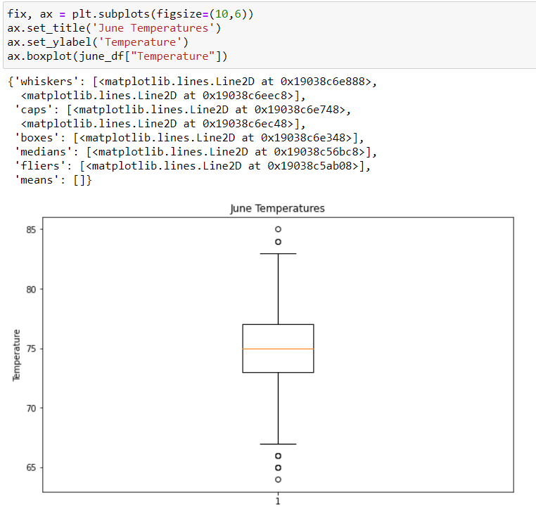
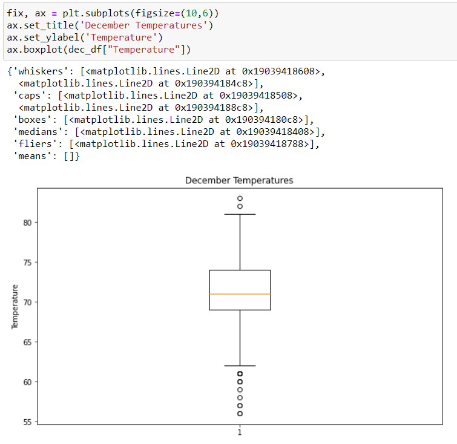

# surfs_up

## Overview of the analysis: 
This analysis uses SQLAlchemy to query a SQLite database in order to find temperature information on the months of June and December in Oahu.

## Results: 
Provide a bulleted list with three major points from the two analysis deliverables. Use images as support where needed.
- 001
- b
- c

## Summary: 
Provide a high-level summary of the results and two additional queries that you would perform to gather more weather data for June and December.

 - Additional Query 1: 
     
     
 
 - Additional Query 2:
 